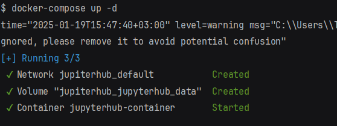
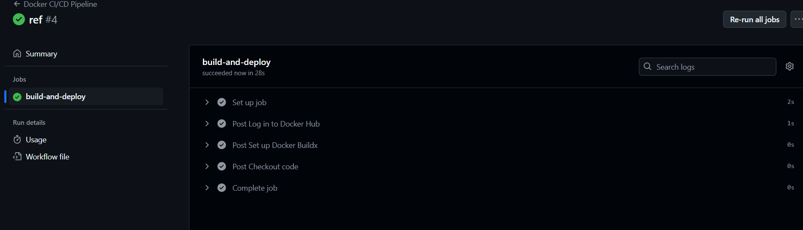

# Задание

Запустить контейнер в jupiter hub. 
Собрать образ в котором параметром выступает корневая директория. 
Запушить образ в docker hub. 
Сделать docker compose (внутри сделать volume). 
Сделать CI пайплайн, 
который будет собирать контейнер jupiter hub, 
тестирует (выводит tested в консоль) и отправлять контейнер в репозиторий github actions.

# Решение

## 1. Создание Docker-образа с параметром корневой директории:

`Dockerfile`
```yaml
    FROM jupyterhub/jupyterhub:latest

    ARG ROOT_DIR=/srv/jupyterhub
    ENV ROOT_DIR=$ROOT_DIR

    WORKDIR $ROOT_DIR

    EXPOSE 8000

    CMD ["jupyterhub"]
```

-  Создание образа с параметром корневой директории:
```bash
    docker build --build-arg ROOT_DIR=/custom/directory -t my-jupyterhub .
```

## 2. Запушить образ в Docker Hub

- Авторизоваться в Docker Hub:
```bash
    docker login
```

- Тегируем образ:
```bash
    docker tag my-jupyterhub denzel94/my-jupyterhub:latest
```

- Отправляем образ:
```bash
    docker push denzel94/my-jupyterhub:latest
```
## 3. Создание docker-compose.yml с volume

```yaml
    version: '3.8'

    services:
      jupyterhub:
        image: denzel94/my-jupyterhub:latest
        container_name: jupyterhub-container
        ports:
          - "8000:8000"
        volumes:
          - jupyterhub_data:/srv/jupyterhub
        environment:
          - ROOT_DIR=/srv/jupyterhub

    volumes:
      jupyterhub_data:
```

- Запустить контейнер с помощью docker-compose:
```bash
    docker-compose up -d
```

## 4. Создание CI/CD пайплайна с GitHub Actions:

- Создаём файл .github/workflows/docker-ci.yml

```yaml
    name: Docker CI/CD Pipeline

    on:
      push:
        branches:
          - main

    jobs:
      build-and-deploy:
        runs-on: ubuntu-latest

        steps:
          - name: Checkout code
            uses: actions/checkout@v3

          - name: Set up Docker Buildx
            uses: docker/setup-buildx-action@v2

          - name: Log in to Docker Hub
            uses: docker/login-action@v2
            with:
              username: ${{ secrets.DOCKER_USERNAME }}
              password: ${{ secrets.DOCKER_PASSWORD }}

          - name: Build Docker Image
            run: |
              docker build --build-arg ROOT_DIR=/srv/jupyterhub -t denzel94/my-jupyterhub:latest .

          - name: Test Docker Image
            run: |
              echo "Testing Docker image..."
              docker run --rm username/my-jupyterhub:latest echo "tested"

          - name: Push Docker Image
            run: |
              docker push username/my-jupyterhub:latest
```
`DOCKER_USERNAME` и `DOCKER_PASSWORD ` добавляем в настройках репозитория в github.

